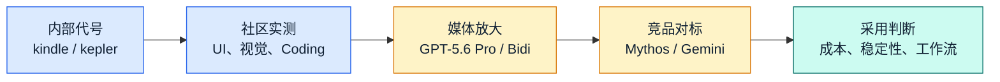

  
GPT-5.6 网络消息观察

  <h1 class="cover-title">风起于未至之境</h1>
  
下一轮模型竞速的四个信号

  

    
UI 生成

    
视觉理解

    
GPT-5.6

    
Agent

    
双向语音

  

  

  基于网络公开资料整理，相关信息不一定准确，请以 OpenAI 后续官方发布为准。
  

<!--
开场先给免责声明，但不要让它成为整场的主角。讲法：今天我们不把这些内容当成官方发布，而是把它当作市场风向和产品路线的提前观察。“风起于未至之境”指的是：模型还未正式落地，但市场已经能感到方向变化。
[click] 先点出这是网络资料整理。
[click] 再展示四个核心能力方向：UI、视觉、Agent、语音。
-->

---
layout: two-cols
---

  <Tweet id="2063245096951160865" scale="0.7"/>

::right::

本周，OpenAI 正在测试 GPT-5.6 的 2 个新检查点，它们在一天之内相继添加——kepler 和 kindle。消息人士告诉我，OpenAI 已将 kindle-alpha 选为发布候选版本。

我在 xhigh 上对两个模型运行了相同的提示，以便你们自行比较。但根据我的经验，平均而言，kindle 相对于 kepler 是一种退步，尽管它们有时仅产生预期范围内的差异。

我预计 5.6 将在本月晚些时候推出，因此他们仍有时间继续优化并放弃 kindle 作为 RC，因为以其当前形式，它将被 Mythos 轻松击败。

---
layout: two-cols
---

  <Tweet id="2064078302394917157" scale="0.35"/>

::right::

<SlidevVideo v-click controls style="height: 35%">
  <!-- HTML video 元素中可以包含的任何内容。 -->
  <source src="/videos/XjHyxKveTVG_xzPR.mp4" type="video/mp4" />
  

    你的浏览器不支持视频。你可以在
    <a href="/videos/XjHyxKveTVG_xzPR.mp4">这里</a>下载。
  

</SlidevVideo>

<!--
Kindle (GPT-5.6) 已在 Arena 中被移除

在 Kindle 被移除后不久，一个新模型 Levi 出现了。该模型的前端输出看起来类似于带有 Design 技能的 OpenAI 模型。Levi 可能也是 GPT-5.6

以下是与 GPT-5.5 的比较

提示词：“为即将到来的世界杯创建一个网站”
-->

---
layout: center
class: thesis
---

# 核心判断

GPT-5.6 的讨论重点，已经从“模型更聪明”转向 
<strong>能否直接进入真实工作流</strong>

  
<b>生成</b>更完整的 UI、图像与交互产物

  
<b>执行</b>更长链路的编码与 Agent 任务

  
<b>协作</b>更自然的实时语音与多模态输入

<!--
这一页要把观众从“又一个模型版本号”带到“工作流能力”的视角。
[click] UI 和视觉是入口。
[click] Agent 和编码是生产力落点。
[click] 语音和多模态是交互方式的变化。
-->

---
layout: default
---

# 一张图看信息如何发酵

真正值得关注的不是单条爆料，而是这些爆料共同指向的产品方向。

<!--
这页用流程图解释：信息先从内部代号和实测流出，再经过媒体叙事，最后影响市场预期。讲的时候强调，我们看的是方向，不是押注每个细节都正确。
-->

---
transition: fade
---

# 四个关键词：这次讨论为什么热

  

    
<carbon:application-web />

    <h2>前端生成</h2>
    
从“写代码”走向“生成可看的产品界面”。

  

  

    
<carbon:image />

    <h2>视觉推理</h2>
    
看图、补全、复刻、解释图表，成为多模态入口。

  

  

    
<carbon:flow-stream />

    <h2>Agentic Coding</h2>
    
长任务、跨文件、持续修复，决定开发者体感。

  

  

    
<carbon:microphone />

    <h2>双向对话</h2>
    
边听边说、可打断、可恢复，改变语音助手体验。

  

<!--
这一页开始增强舞台感。四张卡逐个点击出现，每张只讲一句：界面、视觉、Agent、语音。这四个方向构成后面所有分析的骨架。
-->

---
layout: image-right
image: https://images.unsplash.com/photo-1555066931-4365d14bab8c?auto=format&fit=crop&w=1600&q=80
---

# 方向一：UI 生成从 Demo 走向产品原型

<v-clicks>

- 更少提示词技巧，直接生成完整页面
- 更重视视觉层次、间距、组件状态
- 从“代码能跑”升级为“产品经理能看、前端能改”

</v-clicks>

  Prompt
  Layout
  Component
  Prototype

<!--
讲法：如果 GPT-5.6 真在 UI 生成上有明显提升，价值不只是“帮前端写代码”，而是缩短从想法到原型的时间。
[click] 先讲三个变化。
[click] 最后用 pipeline 总结：Prompt 到 Prototype。
-->

---
layout: default
---

# UI 能力要看三层

  

    <b>视觉层</b>
    颜色、层次、排版、留白、图标
  

  

    <b>工程层</b>
    组件结构、响应式、可维护 CSS、状态处理
  

  

    <b>产品层</b>
    任务路径、空状态、错误态、真实数据密度
  

好看的截图不是终点；能被团队接手，才是生产力。

<!--
这页提醒观众，UI 生成不能只看截图。视觉层吸引人，工程层决定能不能合并，产品层决定是否真的可用。
[click] 逐层展开。
[click] 最后用一句话落到企业采用。
-->

---
layout: default
---

# 方向二：视觉能力变成多模态入口

  

    <h2>看懂</h2>
    
截图、图表、设计稿、扫描件

  

  

    <h2>补全</h2>
    
遮挡区域、缺失结构、上下文线索

  

  

    <h2>转化</h2>
    
图像到代码、图像到说明、图像到流程

  

  

    <h2>审查</h2>
    
发现错位、遗漏、冲突和异常

  

<!--
这里把视觉能力讲成入口，而不是单点功能。它把图片变成模型能操作的上下文，让后续的代码、报告、流程都可以接上。
-->

---
layout: two-cols
layoutClass: gap-12
---

# 方向三：Agentic Coding 的真正分水岭

  
<b>写一段代码</b>

  
<b>改一个模块</b>

  
<b>修一组测试</b>

  
<b>完成跨仓库任务</b>

::right::

  <h2>关键不是“会不会写”</h2>
  
而是能否持续理解目标、检查副作用、根据反馈修正，并在结束时留下可审查的结果。

<!--
这一页用进度条表现任务复杂度。讲的时候从下往上或从上往下都可以：简单代码已经不是稀缺能力，长链路自主修复才是分水岭。
-->

---
layout: fact
class: number-slide
---

# 150 万上下文

如果这一数字成立，它改变的是“模型一次能带多少现场信息”。

<!--
这页只做视觉冲击，不要展开太多。讲法：长上下文不是为了炫数字，而是为了把代码、文档、日志、会议纪要放进同一次推理里。
-->

---
layout: default
---

# 长上下文的业务想象

  

    <h2>研发</h2>
    
一次读完仓库、issue、日志、测试输出，减少来回补材料。

  

  

    <h2>投研</h2>
    
把财报、公告、访谈、竞品资料放入同一分析窗口。

  

  

    <h2>运营</h2>
    
跨系统 SOP、工单、会议纪要串成连续流程。

  

  

    <h2>销售</h2>
    
整合客户历史、产品资料、价格政策，生成下一步动作。

  

<!--
这一页用四个业务场景把“上下文”讲具体。它不是技术参数，而是减少上下文搬运成本。
-->

---
layout: default
---

# GPT-Bidi-1：语音交互的下一种形态

  

    <h2>轮流说话</h2>
    
说完、等待、回答

    像语音菜单
  

  
→

  

    <h2>同频协作</h2>
    
边听边说、可打断、能调整

    像实时助理
  

  
  
  
  
  
  

<!--
讲法：语音 AI 最大的问题不是会不会回答，而是交互节奏。真正自然的语音助手必须能被打断，能继续保持任务上下文。
[click] 先讲旧模式。
[click] 过渡到新模式。
[click] 最后用波形强调实时感。
-->

---
layout: section
class: battle-section
---

# 6 月模型战：能力进入同一战场

<!--
转场页。这里可以停顿一下：前面是 GPT-5.6 的能力方向，后面看为什么这个时间点大家都在卷同一批能力。
-->

---
layout: default
---

# 竞争棋盘

  

    <h2>Anthropic</h2>
    
Mythos / Fable 叙事：推理、编码、复杂任务。

  

  

    <h2>Google</h2>
    
Gemini 叙事：超长上下文、Deep Think、多模态。

  

  

    <h2>OpenAI</h2>
    
GPT-5.6 叙事：UI、视觉、Agent、语音入口。

  

  Benchmark
  <b></b>
  Workflow

<!--
这里不要陷入谁赢谁输。重点是三家都在向同一个方向收敛：从公开榜单竞争，转向真实工作流竞争。
-->

---
layout: default
---

# 企业采用看这四个数

  

    <b>一次成功率</b>
    不用反复改 prompt 的比例
  

  

    <b>人工接管率</b>
    任务中途需要人救场的次数
  

  

    <b>端到端成本</b>
    Token、延迟、重试、人审综合成本
  

  

    <b>可审查性</b>
    输出是否能解释、回滚、复现
  

<!--
这一页把话题从模型热度拉回企业现实。最终采购不会只看“哪个模型更强”，而是看任务能不能稳定完成、成本是否可控。
-->

---
layout: two-cols-header
layoutClass: gap-10
---

# 发布后 72 小时评测清单

::left::

<v-clicks>

- 同一批真实任务，不换 prompt
- 记录首轮输出、修复轮数、失败原因
- 同时跑 UI、代码、视觉、长上下文、语音任务

</v-clicks>

::right::

  <h2>目标</h2>
  
用自己的业务任务判断价值，而不是等别人替你定义榜单。

<!--
这一页给观众一个可执行动作：发布后不要只刷测评视频，直接拿自己的任务集跑。72 小时足够建立第一版采用判断。
-->

---
layout: center
class: final-call
---

# 结论

  

    <b>看方向</b>
    UI、视觉、Agent、语音正在合流。
  

  

    <b>看场景</b>
    真正价值来自真实工作流，而不是单点演示。
  

  

    <b>看成本</b>
    能力、价格、稳定性会共同决定采用速度。
  

<!--
最后三句话收束全场：看方向、看场景、看成本。不要把重点放在爆料本身，而是放在下一阶段模型产品化的竞争逻辑。
-->

---

# 资料来源

- 知乎 / 量子位：《GPT-5.6首批实测来了！精准狙击Mythos》，2026-06-10  
  https://zhuanlan.zhihu.com/p/2048051453957255944
- CSDN 转载：《OpenAI背水一战！GPT-5.6 Pro凭空作画、GPT-Bidi-1双向对谈》，2026-06-23  
  https://blog.csdn.net/techforward/article/details/162240195
- 搜狐移动页，用户提供链接  
  https://m.sohu.com/a/1040423777_211762
- BNext 数位时代，用户提供链接  
  https://www.bnext.com.tw/article/91303/gpt-5-6-pro-openai-the-sims-reasoning-25-percent
- OpenAI 官方网站，用于核对公开发布信息  
  https://openai.com/

<!--
资料页不需要展开讲太久。只提醒观众：本 deck 是网络资料观察，后续如果 OpenAI 正式发布，需要更新数据和结论。
-->

---
layout: cover
title: 谢谢
background: https://cover.sli.dev
---

# 谢谢!
