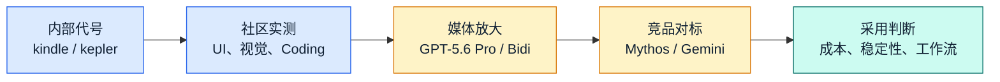

  
GPT-5.6 网络消息观察

  <h1 class="cover-title">风起于未至之境</h1>
  
下一轮模型竞速的四个信号

  

    
UI 生成

    
视觉理解

    
GPT-5.6

    
Agent

    
双向语音

  

  

  基于网络公开资料整理，相关信息不一定准确，请以 OpenAI 后续官方发布为准。
  

<!--
各位好，今天这份分享会围绕 GPT-5.6 的网络消息展开。先说明一下：这里的内容来自公开网页、媒体报道和社区讨论，不代表 OpenAI 官方发布，也可能会随着后续信息变化。

我把标题定为“风起于未至之境”，因为这次有意思的地方在于，模型还没有以正式产品形态完整出现，但市场已经开始感受到下一轮模型竞速的方向。

[click] 我们先把它当作一次网络消息观察，而不是官方发布解读。
[click] 接下来我会围绕四个信号展开：UI 生成、视觉理解、Agent，以及双向语音。
-->

---
layout: two-cols
---

  <Tweet id="2063245096951160865" scale="0.7"/>

::right::

本周，OpenAI 正在测试 GPT-5.6 的 2 个新检查点，它们在一天之内相继添加——kepler 和 kindle。消息人士告诉我，OpenAI 已将 kindle-alpha 选为发布候选版本。

我在 xhigh 上对两个模型运行了相同的提示，以便你们自行比较。但根据我的经验，平均而言，kindle 相对于 kepler 是一种退步，尽管它们有时仅产生预期范围内的差异。

我预计 5.6 将在本月晚些时候推出，因此他们仍有时间继续优化并放弃 kindle 作为 RC，因为以其当前形式，它将被 Mythos 轻松击败。

<!--
这一页是整场分享的信息起点。左侧这条推文提到，OpenAI 可能正在测试两个与 GPT-5.6 相关的新检查点：kepler 和 kindle。

[click] 第一，kindle-alpha 被描述为发布候选；第二，爆料者认为 kindle 相比 kepler 并不是稳定进步，甚至可能在部分任务上退步。

这说明我们在看 GPT-5.6 时，不应该只把它理解成一个线性升级版本。它更像是一组候选能力和路线的竞争，最终哪个版本发布，仍然取决于稳定性、体验和竞品压力。
-->

---
layout: two-cols
---

  <Tweet id="2064078302394917157" scale="0.35"/>

::right::

<SlidevVideo v-click controls style="height: 35%">
  <source src="/videos/XjHyxKveTVG_xzPR.mp4" type="video/mp4" />
  

    你的浏览器不支持视频。你可以在
    <a href="/videos/XjHyxKveTVG_xzPR.mp4">这里</a>下载。
  

</SlidevVideo>

<!--
这里是另一个社区观察。原先被认为可能对应 GPT-5.6 的 Kindle 模型，后来从 Arena 中被移除；不久之后，一个新模型 Levi 又出现了。

从这段演示看，Levi 的前端输出更像是带有设计能力的 OpenAI 模型：它不只是生成代码，还会尝试处理版式、视觉层次和完整页面结构。

[click] 右侧这段视频对比的是类似提示词下的网页生成效果。提示词是：“为即将到来的世界杯创建一个网站”。我们重点看它是否更接近“可展示的原型”，而不只是能跑的页面。
-->

---
layout: center
class: thesis
---

# 核心判断

GPT-5.6 的讨论重点，已经从“模型更聪明”转向 
<strong>能否直接进入真实工作流</strong>

  
<b>生成</b>更完整的 UI、图像与交互产物

  
<b>执行</b>更长链路的编码与 Agent 任务

  
<b>协作</b>更自然的实时语音与多模态输入

<!--
我的核心判断是：GPT-5.6 相关讨论的重点，已经不只是“模型是不是更聪明”，而是它能不能直接进入真实工作流。

[click] 第一层变化，是生成能力更接近实际产物，比如完整 UI、图像和交互。
[click] 第二层变化，是执行能力更接近复杂任务，比如长链路编码和 Agent 工作。
[click] 第三层变化，是协作方式变得更自然，比如实时语音和多模态输入。
-->

---
layout: default
---

# 一张图看信息如何发酵

真正值得关注的不是单条爆料，而是这些爆料共同指向的产品方向。

<!--
这张图展示的是信息发酵的路径。最早是内部代号和社区实测，随后媒体把它包装成更清晰的版本叙事，再进一步进入竞品对标和采用判断。

[click] 我认为真正值得关注的不是某一条爆料是否百分之百准确，而是这些爆料共同指向了同一个方向：模型竞争正在从参数和榜单，转向真实工作流里的可用性。
-->

---
transition: fade
---

# 四个关键词：这次讨论为什么热

  

    
<carbon:application-web />

    <h2>前端生成</h2>
    
从“写代码”走向“生成可看的产品界面”。

  

  

    
<carbon:image />

    <h2>视觉推理</h2>
    
看图、补全、复刻、解释图表，成为多模态入口。

  

  

    
<carbon:flow-stream />

    <h2>Agentic Coding</h2>
    
长任务、跨文件、持续修复，决定开发者体感。

  

  

    
<carbon:microphone />

    <h2>双向对话</h2>
    
边听边说、可打断、可恢复，改变语音助手体验。

  

<!--
这次讨论之所以热，是因为它同时碰到了四个高价值入口。

[click] 第一个是前端生成，它把模型从“写代码”推向“直接生成产品界面”。
[click] 第二个是视觉推理，它让截图、图表、设计稿都能成为模型可处理的上下文。
[click] 第三个是 Agentic Coding，它决定模型能不能持续完成复杂开发任务。
[click] 第四个是双向对话，它可能改变我们和语音助手协作的节奏。

后面的分析，基本都会围绕这四个方向展开。
-->

---
layout: image-right
image: https://images.unsplash.com/photo-1555066931-4365d14bab8c?auto=format&fit=crop&w=1600&q=80
---

# 方向一：UI 生成从 Demo 走向产品原型

<v-clicks>

- 更少提示词技巧，直接生成完整页面
- 更重视视觉层次、间距、组件状态
- 从“代码能跑”升级为“产品经理能看、前端能改”

</v-clicks>

  Prompt
  Layout
  Component
  Prototype

<!--
先看 UI 生成。如果 GPT-5.6 真的在这个方向有明显提升，它的价值就不只是“帮前端写几段代码”，而是缩短从想法到原型的时间。

[click] 一个变化是提示词技巧的重要性下降，模型可以更直接地生成完整页面。
[click] 第二个变化是视觉层次、间距和组件状态会变得更重要，因为这些决定页面是否像真实产品。
[click] 第三个变化是产物标准会提高：不只是代码能跑，而是产品经理能看，前端工程师也能接着改。

[click] 所以这条链路可以概括为：从 Prompt，到 Layout，到 Component，最后到 Prototype。
-->

---
layout: default
---

  

---
layout: default
---

# UI 能力要看三层

  

    <b>视觉层</b>
    颜色、层次、排版、留白、图标
  

  

    <b>工程层</b>
    组件结构、响应式、可维护 CSS、状态处理
  

  

    <b>产品层</b>
    任务路径、空状态、错误态、真实数据密度
  

好看的截图不是终点；能被团队接手，才是生产力。

<!--
不过，UI 生成不能只看截图好不好看。我们应该把它拆成三层来看。

[click] 第一层是视觉层，也就是颜色、层次、排版、留白和图标。这一层决定第一眼是否可信。
[click] 第二层是工程层，也就是组件结构、响应式、CSS 可维护性和状态处理。这一层决定团队能不能接手。
[click] 第三层是产品层，也就是任务路径、空状态、错误态和真实数据密度。这一层决定它是不是真的可用。

[click] 所以，好看的截图不是终点；能被团队接手，才是生产力。
-->

---
layout: default
---

# 方向二：视觉能力变成多模态入口

  

    <h2>看懂</h2>
    
截图、图表、设计稿、扫描件

  

  

    <h2>补全</h2>
    
遮挡区域、缺失结构、上下文线索

  

  

    <h2>转化</h2>
    
图像到代码、图像到说明、图像到流程

  

  

    <h2>审查</h2>
    
发现错位、遗漏、冲突和异常

  

<!--
第二个方向是视觉能力。这里我不把它看成一个单点功能，而是把它看成多模态工作流的入口。

[click] 模型先要看懂截图、图表、设计稿和扫描件。
[click] 然后它要能补全被遮挡的区域、缺失的结构和上下文线索。
[click] 再往后，它可以把图像转成代码、说明文档或流程。
[click] 最后，它还可以做审查，帮我们发现错位、遗漏、冲突和异常。

一旦图片变成模型可操作的上下文，后面的代码、报告和流程就都能接上。
-->

---
layout: two-cols
layoutClass: gap-12
---

# 方向三：Agentic Coding 的真正分水岭

  
<b>写一段代码</b>

  
<b>改一个模块</b>

  
<b>修一组测试</b>

  
<b>完成跨仓库任务</b>

::right::

  <h2>关键不是“会不会写”</h2>
  
而是能否持续理解目标、检查副作用、根据反馈修正，并在结束时留下可审查的结果。

<!--
第三个方向是 Agentic Coding。这里的分水岭不是模型会不会写代码，而是它能不能把任务持续做完。

[click] 写一段代码，现在已经不是最难的部分。
[click] 改一个模块，需要理解上下文和局部约束。
[click] 修一组测试，需要根据反馈定位问题，再继续迭代。
[click] 完成跨仓库任务，才真正考验模型的目标保持、环境理解和副作用控制。

[click] 所以关键不是“会不会写”，而是能否持续理解目标、检查副作用、根据反馈修正，并在最后留下可审查的结果。
-->

---
layout: fact
class: number-slide
---

# 150 万上下文

如果这一数字成立，它改变的是“模型一次能带多少现场信息”。

<!--
这里的“150 万上下文”如果成立，真正改变的不是数字本身，而是模型一次能带入多少现场信息。

长上下文不是为了炫参数，而是为了把代码、文档、日志、会议纪要、历史讨论放进同一次推理里。它减少的是人反复搬运背景资料的成本。
-->

---
layout: default
---

# 长上下文的业务想象

  

    <h2>研发</h2>
    
一次读完仓库、issue、日志、测试输出，减少来回补材料。

  

  

    <h2>投研</h2>
    
把财报、公告、访谈、竞品资料放入同一分析窗口。

  

  

    <h2>运营</h2>
    
跨系统 SOP、工单、会议纪要串成连续流程。

  

  

    <h2>销售</h2>
    
整合客户历史、产品资料、价格政策，生成下一步动作。

  

<!--
把长上下文放到业务里看，会更具体。

[click] 在研发场景里，它可以一次读完仓库、issue、日志和测试输出，减少来回补材料。
[click] 在投研场景里，它可以把财报、公告、访谈和竞品资料放在同一个分析窗口里。
[click] 在运营场景里，它可以把 SOP、工单和会议纪要串成连续流程。
[click] 在销售场景里，它可以整合客户历史、产品资料和价格政策，生成下一步动作。

所以长上下文不是一个孤立技术参数，它对应的是上下文搬运成本的下降。
-->

---
layout: default
---

# GPT-Bidi-1：语音交互的下一种形态

  

    <h2>轮流说话</h2>
    
说完、等待、回答

    像语音菜单
  

  
→

  

    <h2>同频协作</h2>
    
边听边说、可打断、能调整

    像实时助理
  

  
  
  
  
  
  

<!--
再看语音交互。语音 AI 最大的问题，往往不是会不会回答，而是交互节奏是否自然。

[click] 旧模式更像轮流说话：我说完，系统等待，然后回答。这种体验更接近语音菜单。
[click] →
[click] 新模式应该更像同频协作：它可以边听边说，可以被打断，也能根据我的补充继续调整。
[click] 如果 GPT-Bidi-1 代表的是这种方向，那么它改变的不是一个语音功能，而是人和模型协作的节奏。
-->

---
layout: section
class: battle-section
---

# 6 月模型战：能力进入同一战场

<!--
到这里，我们已经看完 GPT-5.6 相关消息里最核心的几个能力方向。

接下来换一个视角：为什么在 6 月这个时间点，几家头部模型公司几乎都在卷同一批能力？这说明模型竞争正在进入同一个战场。
-->

---
layout: default
---

# 竞争棋盘

  

    <h2>Anthropic</h2>
    
Mythos / Fable 叙事：推理、编码、复杂任务。

  

  

    <h2>Google</h2>
    
Gemini 叙事：超长上下文、Deep Think、多模态。

  

  

    <h2>OpenAI</h2>
    
GPT-5.6 叙事：UI、视觉、Agent、语音入口。

  

  Benchmark
  <b></b>
  Workflow

<!--
这张竞争棋盘里，我不想简单判断谁赢谁输。更重要的是，几家公司正在向同一个方向收敛。

[click] Anthropic 的叙事集中在推理、编码和复杂任务。
[click] Google 的叙事集中在超长上下文、Deep Think 和多模态。
[click] OpenAI 的 GPT-5.6 相关叙事，则更突出 UI、视觉、Agent 和语音入口。

[click] 这说明竞争重心正在从 Benchmark 转向 Workflow，也就是从公开榜单转向真实工作流。
-->

---
layout: default
---

# 企业采用看这四个数

  

    <b>一次成功率</b>
    不用反复改 prompt 的比例
  

  

    <b>人工接管率</b>
    任务中途需要人救场的次数
  

  

    <b>端到端成本</b>
    Token、延迟、重试、人审综合成本
  

  

    <b>可审查性</b>
    输出是否能解释、回滚、复现
  

<!--
回到企业采用，最终大家不会只问“哪个模型最强”，而是会看四个更现实的指标。

[click] 第一个是一次成功率，也就是不用反复改 prompt 的比例。
[click] 第二个是人工接管率，也就是任务中途需要人救场的次数。
[click] 第三个是端到端成本，它包括 token、延迟、重试和人工审核的综合成本。
[click] 第四个是可审查性，也就是输出是否能解释、回滚和复现。

真正能进入企业工作流的模型，必须同时回答这四个问题。
-->

---
layout: two-cols-header
layoutClass: gap-10
---

# 发布后 72 小时评测清单

::left::

<v-clicks>

- 同一批真实任务，不换 prompt
- 记录首轮输出、修复轮数、失败原因
- 同时跑 UI、代码、视觉、长上下文、语音任务

</v-clicks>

::right::

  <h2>目标</h2>
  
用自己的业务任务判断价值，而不是等别人替你定义榜单。

<!--
如果后续 GPT-5.6 或类似模型正式发布，我建议在前 72 小时就建立自己的评测清单。

[click] 第一，同一批真实任务，不换 prompt，这样才能比较模型本身的稳定性。
[click] 第二，记录首轮输出、修复轮数和失败原因，不要只看最漂亮的结果。
[click] 第三，同时覆盖 UI、代码、视觉、长上下文和语音任务，因为单点能力不能代表完整工作流。

[click] 目标不是等别人替我们定义榜单，而是用自己的业务任务判断价值。
-->

---
layout: center
class: final-call
---

# 结论

  

    <b>看方向</b>
    UI、视觉、Agent、语音正在合流。
  

  

    <b>看场景</b>
    真正价值来自真实工作流，而不是单点演示。
  

  

    <b>看成本</b>
    能力、价格、稳定性会共同决定采用速度。
  

<!--
最后用三句话收束。

[click] 第一，看方向。UI、视觉、Agent 和语音正在合流，模型不再只是回答问题，而是在进入工作流入口。
[click] 第二，看场景。真正价值来自真实任务，而不是单点演示。
[click] 第三，看成本。能力、价格和稳定性会共同决定采用速度。

所以我不会把重点放在某条爆料本身，而是把它看成下一阶段模型产品化竞争的信号。
-->

---

# 资料来源

- 知乎 / 量子位：《GPT-5.6首批实测来了！精准狙击Mythos》  
  https://zhuanlan.zhihu.com/p/2048051453957255944
- CSDN 转载：《OpenAI背水一战！GPT-5.6 Pro凭空作画、GPT-Bidi-1双向对谈》  
  https://blog.csdn.net/techforward/article/details/162240195
- 搜狐：《GPT-5.6大量实测流出：本周四或登场》  
  https://m.sohu.com/a/1040423777_211762
- BNext 数位时代：《还没正式发布，GPT-5.6 Pro一句话就造出了《模拟市民》！ OpenAI在测试什么？》  
  https://www.bnext.com.tw/article/91303/gpt-5-6-pro-openai-the-sims-reasoning-25-percent

<!--
这里列出本次整理参考的主要来源。再次提醒一下，这份 deck 是基于网络公开资料做的观察，不等同于官方发布。

如果 OpenAI 后续正式发布相关模型或能力，这里的数据、名称和判断都需要再更新一次。
-->

---
layout: cover
title: 谢谢
background: https://cover.sli.dev
---

# 谢谢!
